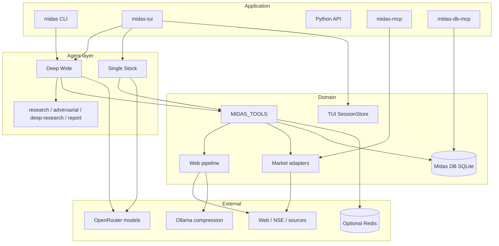

<div align="center">

# Midas

**Long-horizon Indian equity research with a durable, auditable paper trail**

Midas turns a sector, NSE index, company, or research question into staged multi-agent diligence—primary screening, adversarial challenge, equal-depth deep research, and an investment-committee decision—persisted in **Midas DB**, not a stack of Markdown/PDF files.

[](https://www.python.org/)
[](./pyproject.toml)
[](https://textual.textualize.io/)
[](https://github.com/langchain-ai/deepagents)
[](https://modelcontextprotocol.io/)
[](https://docs.astral.sh/uv/)
[](./LICENSE)

</div>

---

## Overview

Midas is research software for **one-to-two-year, owner-style** Indian public-equity analysis. It separates business quality, valuation, evidence confidence, governance, and liquidity; allows **zero to three** final selections; and labels incomplete work as *Insufficient Evidence* instead of inventing answers.

| Surface | Role |
| --- | --- |
| **Deep Wide Research Agent** | Screen a sector, index, or multi-name universe through independent screens, red-team challenge, equal-depth diligence, and IC decision. |
| **Single Stock Research Agent** | Investment-grade dossier on exactly one listed company. |
| **Textual TUI** (`midas-tui`) | Interactive sessions with Shift+Tab mode switching, streaming tool activity, and resume. |
| **CLI** (`midas`) | One-shot research from the terminal. |
| **Library** | Web research, fundamentals, and market-signal helpers as Pydantic models. |
| **MCP** | Two stdio servers for external hosts (Codex, Cursor, Claude Desktop): market info and Midas DB. |

**Durable output lives in Midas DB** (SQLite): research runs, append-only evidence, securities master, and optional paper portfolios. Agents write stage results as evidence rows and store the final A–J decision text on the run (`report_md`). Intermediate Markdown files and PDF/HTML final reports are **not** required deliverables.

> [!NOTE]
> Conclusions are research assessments for a stated analysis cut-off. They are **not** brokerage execution, personalized investment advice, or guaranteed market data. Paper-portfolio tools are ledger demos, not live trading.

---

## Features

| Area | What you get |
| --- | --- |
| **Two research modes** | Deep Wide (universe funnel) and Single Stock (one name, full depth). |
| **Decision standard** | Reproducible quality scoring, ordered gates, valuation zones, scenario returns, zero-to-three selections. |
| **Midas DB** | SQLite store for research runs, evidence ledger, companies/securities, paper portfolios, cash/trade ledger, thesis revisions. |
| **Indian market tools** | Fundamentals, filings, quotes, trading history, index constituents, scans, calendars, deals, derivatives, institutional flows, market context. |
| **Grounded web research** | Search → Camoufox/HTTP fetch → main-text extract → Ollama compression (full cleaned text retained on success). |
| **Dual MCP servers** | `midas-mcp` (market info) and `midas-db-mcp` (DB / portfolio / research runs). |
| **DeepAgents integration** | Same market + DB tools registered on LangChain agents (`MIDAS_TOOLS`). |
| **Interactive TUI** | Mode switch, live agents/tools/todos, session list/resume, isolated session workspaces. |
| **Resilience** | Per-source single-flight gates, sequential market-tool policy, optional fail-open Redis cache. |
| **Optional charts** | Bar, line, area, pie, stacked-bar, scatter, heatmap PNGs for the chat—not the system of record. |

---

## From prompt to decision (Deep Wide)

```mermaid
flowchart LR
  A[User prompt] --> B[Lead analyst]
  B --> C[research_run_create + mandate]
  C --> D[universe evidence]
  D --> E[Research agent]
  E --> F[primary_screen + shortlist]
  F --> G[Adversarial agent]
  G --> H[blind + red team]
  H --> I[deep_dive_shortlist]
  I --> J[Deep-research agent]
  J --> K[equal_depth]
  K --> L[finalist_bear]
  L --> M[ic_decision]
  M --> N[Report agent]
  N --> O[report_md + COMPLETED in DB]
```



Stages run **sequentially** because market scrape tools are single-flight per source (fundamentals, signals, NSE, web, X). Only `web_research` is exempt from the cross-market sequencing rule. Successful expensive tool responses can be cached in Redis; errors are never cached.

### Evidence ledger (system of record)

Each request creates **one** research run. Stage work is append-only:

| `record_type` | Owner |
| --- | --- |
| `mandate` | Lead |
| `universe` | Lead |
| `primary_screen` / `primary_shortlist` | Research agent |
| `adversary_independent` / `adversary_critique` | Adversarial agent |
| `deep_dive_shortlist` | Lead |
| `equal_depth` | Deep-research agent |
| `finalist_bear` | Adversarial agent |
| `ic_decision` | Lead |
| sources / calculations | Any stage (`source`, `calculation`, …) |

Final A–J decision text is stored via `research_run_set_report` and finalized with `research_run_complete`. Chat returns the **`research_run_id`** and a short synthesis—not a PDF path.

**A–J report structure** (in `report_md`): Executive Decision Summary · Candidate Funnel · Complete Comparative Matrix · Primary-Source Evidence Map · Governance and Capital-Allocation Matrix · Expected-Return Models · False-Negative Challenge · Final Candidates · Rejected Finalists · Final Conclusion.

---

## Architecture



**Design notes:**

- **Agent construction** — `create_research_agent(mode)` for TUI dispatch; `create_midas_agent()` / `create_single_stock_agent()` for explicit graphs. Both share `MIDAS_TOOLS` (market + DB + charts + web).
- **Models** — lead/research/adversarial: OpenRouter `openai/gpt-5.6-luna` (medium reasoning); deep-research and report synthesis: same model, high reasoning. Compression uses a local Ollama OpenAI-compatible endpoint.
- **Tool contracts** — compact JSON with `ok`; market tools may return `status: "busy"` / `retryable: true`. DB tools share the same response shape.
- **Persistence** — research and paper portfolios in `midas.db` (override with `MIDAS_DB_PATH`); TUI chat sessions in `output/.midas-sessions.sqlite3`; optional session workspaces under `output/<session-id>/` for charts/scratch only.

---

## Midas DB

SQLite **STRICT** tables, WAL mode, foreign keys. Schema source of truth: `src/midas/db/migrate.py` (versions 1–3) and `src/midas/db/schema.bootstrap.sql`.

| Domain | Tables (high level) |
| --- | --- |
| Master data | `companies`, `securities`, `market_prices` |
| Paper portfolio | `portfolios`, `portfolio_accounts`, `investment_cases`, `thesis_revisions`, `transactions` |
| Research | `research_runs`, `research_run_securities`, `research_evidence`, `research_portfolio_links` |

```bash
# Apply migrations (creates midas.db in the project root by default)
uv run midas-db-migrate

# Or bootstrap from SQL
sqlite3 midas.db < src/midas/db/schema.bootstrap.sql
```

Environment:

```dotenv
MIDAS_DB_PATH=/absolute/path/to/midas.db   # optional
```

Python:

```python
from midas.db import run_migrations, portfolios_service, research_runs_service
from midas.db.models import CreatePortfolioInput, CreateResearchRunInput

run_migrations()
pf = portfolios_service.create(CreatePortfolioInput(name="Demo book"))
run = research_runs_service.create(
    CreateResearchRunInput(
        slug="reliance-7y",
        workflow="single_stock",
        universe_or_company="Reliance Industries",
        horizon_text="7 years",
    )
)
```

---

## Tech stack

| Layer | Technology |
| --- | --- |
| Language | Python 3.12+ |
| Packaging | [uv](https://docs.astral.sh/uv/), project `midas` 0.1.0 |
| UI | [Textual](https://textual.textualize.io/) |
| Agents | [DeepAgents](https://github.com/langchain-ai/deepagents), LangGraph, LangChain tools |
| MCP | [MCP](https://modelcontextprotocol.io/) Python SDK (FastMCP) |
| Models | [OpenRouter](https://openrouter.ai/) (`openai/gpt-5.6-luna`); Ollama for compression |
| Search / fetch | ddgs, Camoufox, httpx, BeautifulSoup/lxml, trafilatura |
| Market data | `nse`, `nselib`, `indian-market-data`, HTTP helpers |
| Persistence | SQLite (Midas DB + TUI sessions); optional Redis tool cache |
| Charts | Pillow PNG tools |
| Quality | pytest, pytest-asyncio, ruff |

---

## Project structure

```text
midas/
├── pyproject.toml
├── agents/                          # Harness-agnostic role instructions
│   ├── shared/                      # Policy + tool/MCP guidance
│   ├── deep-wide/                   # Lead + stage roles
│   └── single-stock/
├── examples/
├── src/midas/
│   ├── cli.py                       # midas
│   ├── mcp_server.py                # midas-mcp (market)
│   ├── db_mcp_server.py             # midas-db-mcp (DB)
│   ├── pipeline.py                  # Web search → scrape → compress
│   ├── market_data.py
│   ├── sessions.py                  # TUI SQLite sessions
│   ├── db/                          # Midas DB
│   │   ├── schema.bootstrap.sql
│   │   ├── migrate.py               # midas-db-migrate
│   │   ├── connection.py
│   │   ├── models.py
│   │   ├── repositories/
│   │   └── services/
│   ├── tui/
│   └── deepagents/
│       ├── deepagent.py             # Agent factories + tool guidance
│       ├── tools.py                 # Market + web + charts
│       ├── db_tools.py              # In-process DB tools (same as midas-db-mcp)
│       ├── prompts.py               # DB-driven workflow contracts
│       ├── charts.py
│       ├── model.py
│       └── cache.py
├── tests/
└── output/                          # Sessions, optional charts (gitignored bulk)
```

---

## Requirements

- **Python** 3.12+ and [uv](https://docs.astral.sh/uv/)
- **Camoufox** browser binary (`uv run python -m camoufox fetch`)
- **Ollama** for compression (`gpt-oss:120b-cloud` by default)
- **Credentials**
  - `OPENROUTER_API_KEY` — required for research agents
  - `OPENAI_API_KEY` — expected by the TUI setup check; also used as a non-empty key for the Ollama OpenAI-compatible client
- **Network** for search and market tools
- **Optional:** Redis (`MIDAS_REDIS_URL` / `REDIS_URL`); local `grok` CLI for `twitter_search` (capped per agent)

---

## Getting started

### 1. Install

```bash
git clone <repository-url>
cd Midas
uv sync
uv run python -m camoufox fetch
```

### 2. Environment

```bash
cp .env.example .env
```

```dotenv
OPENROUTER_API_KEY=...
OPENAI_API_KEY=...
OLLAMA_BASE_URL=http://localhost:11434/v1
# MIDAS_DB_PATH=./midas.db
# MIDAS_REDIS_URL=redis://localhost:6379/0
```

```bash
ollama pull gpt-oss:120b-cloud
uv run midas-db-migrate
```

### 3. Run research

```bash
# One-shot CLI
uv run midas "Summarize TCS's latest results and concall guidance"
uv run midas "NIFTY IT quality screen, 2-year horizon"

# Interactive TUI
uv run midas-tui
```

### 4. Library

```python
from midas import web_search

result = web_search("Recent developments in sodium-ion batteries", max_results=5)
print(result.compressed)
```

```python
from midas.deepagents.deepagent import create_research_agent
from midas.deepagents.modes import ResearchMode

agent = create_research_agent(ResearchMode.SINGLE_STOCK)
# await agent.ainvoke({"messages": [("user", "...")]})
```

> [!IMPORTANT]
> Do not commit API keys. Respect third-party terms, robots rules, and rate limits when fetching external data.

---

## MCP servers

### Market info — `midas-mcp`

Exposes fundamentals, signals, and NSE/market-structure tools. **Not** included: web search, X/Twitter, charts, agent UI helpers.

```bash
uv run midas-mcp
```

| Behavior | Detail |
| --- | --- |
| Concurrency | One active call per source; process-wide sequential gate across market tools |
| Busy response | JSON `ok: false`, `status: "busy"`, `retryable: true` |
| Timeout | Hosts should allow ~180s for slow scrapes |

### Midas DB — `midas-db-mcp`

Paper portfolios, securities master, investment cases, thesis revisions, transactions, research runs, and evidence ledger. Same operations as in-process `db_tools` on DeepAgents.

```bash
uv run midas-db-mcp
```

| Behavior | Detail |
| --- | --- |
| Schema | Migrations run on server start |
| Money | Integer **paise** (₹1 = 100 paise) |
| Quantity | Integer **micros** (1 share = 1_000_000 micros) |
| Time | Epoch milliseconds |

### Codex config example

```toml
[mcp_servers.midas]
command = "uv"
args = ["run", "--directory", "/absolute/path/to/Midas", "midas-mcp"]
tool_timeout_sec = 180

[mcp_servers.midas-db]
command = "uv"
args = ["run", "--directory", "/absolute/path/to/Midas", "midas-db-mcp"]
tool_timeout_sec = 60
```

### Cursor / Claude Desktop-style hosts

```json
{
  "mcpServers": {
    "midas": {
      "command": "uv",
      "args": ["run", "--directory", "/absolute/path/to/Midas", "midas-mcp"]
    },
    "midas-db": {
      "command": "uv",
      "args": ["run", "--directory", "/absolute/path/to/Midas", "midas-db-mcp"]
    }
  }
}
```

Harness-agnostic agent instructions (roles, evidence types, tool names) live under [`agents/`](./agents/).

---

## TUI controls

| Input | Action |
| --- | --- |
| `/` | Slash-command dropdown |
| `Enter` | Submit prompt (or complete command) |
| `Ctrl+C` | Cancel active research, or quit when idle |
| `Ctrl+N` / `/new` | New session in the current mode |
| `Shift+Tab` | Switch research mode (new session) |
| `/sessions` | List resumable sessions |
| `/resume [id]` | Resume a session |
| `F2` / `F3` | Toggle agents/todos and files panes |
| `/exit` | Save and exit |

Sessions: `output/.midas-sessions.sqlite3`. Mode switches start a **new** session so deep-wide and single-stock context are not mixed.

---

## Testing

```bash
uv run ruff check .
uv run pytest

# Live network + Camoufox (opt-in)
MIDAS_RUN_INTEGRATION=1 uv run pytest -m integration
```

Coverage includes cleaning/pipeline models, market adapters, DeepAgent tools and DB-driven workflow contracts, Midas DB services, MCP registration, CLI/TUI wiring, and sessions.

---

## CLI entry points

| Command | Purpose |
| --- | --- |
| `midas` | One-shot research CLI |
| `midas-tui` | Interactive Textual app |
| `midas-mcp` | Market-info MCP (stdio) |
| `midas-db-mcp` | Midas DB MCP (stdio) |
| `midas-db-migrate` | Apply SQLite migrations |

---

## Roadmap

- Align TUI credential checks with tools that actually need each key (e.g. vision helper vs. research path).
- Expand `.env.example` for OpenRouter, Redis, `MIDAS_DB_PATH`, and chart paths.
- Further ergonomics for large equal-depth batches without thinning the fixed diligence packet.
- Optional read-only UI over research runs and paper portfolios.

---

## Disclaimer

**Not investment advice.** Midas is research software for educational and informational use. Outputs are automated research assessments for a stated analysis cut-off. They are **not** personalized investment recommendations, solicitations to buy or sell securities, portfolio management, brokerage services, or financial, legal, or tax advice. You are solely responsible for any investment decisions and for complying with laws that apply to you.

**No warranties; use at your own risk.** The software and any data it retrieves are provided “as is,” without warranty of accuracy, completeness, timeliness, or fitness for a particular purpose. Market data can be delayed, incomplete, misparsed, or wrong. Do not rely on tool output as a sole basis for trading or compliance decisions.

**Paper portfolios are not brokerage.** Deposits, buys, and sells recorded in Midas DB are demo ledger events only. They do not place orders or move real capital.

**Third-party data and terms.** Midas may fetch information from public web pages, exchanges, and other third-party services. Those sources are not affiliated with this project. Comply with each provider’s terms, robots rules, rate limits, and applicable law. This repository does **not** grant any license to third-party content or trademarks.

**Liability.** To the maximum extent permitted by law, authors and contributors are not liable for any loss or damage arising from use of this software or reliance on its outputs—including trading losses, data inaccuracies, or account restrictions imposed by third parties.

---

## License

Licensed under the [Apache License, Version 2.0](./LICENSE).

You may use, modify, and distribute this software under that license. Redistribution must preserve the copyright notice, license text, and any `NOTICE` file. The license does **not** grant trademark rights in the project name. This is a plain-language summary only; the full legal text is in [`LICENSE`](./LICENSE).

---

<div align="center">
  Built with Python, DeepAgents, Textual, SQLite, and a stubborn preference for source-backed equity research over narrative conviction.
</div>
