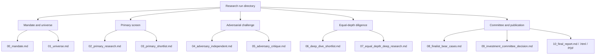
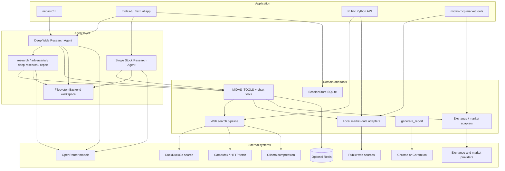

<div align="center">

# Midas

**Long-horizon Indian equity research with an auditable paper trail**

Midas turns a sector, NSE index, company, or research question into staged multi-agent diligence: primary screening, adversarial challenge, equal-depth deep research, and a validated decision report with Markdown, HTML, and PDF outputs.

[](https://www.python.org/)
[](./pyproject.toml)
[](https://textual.textualize.io/)
[](https://github.com/langchain-ai/deepagents)
[](https://docs.astral.sh/uv/)
[](./LICENSE)

</div>

---

## Overview

Midas provides two equity-research modes. The **Deep Wide Research Agent** screens an Indian sector or NSE universe through primary, adversarial, equal-depth, and investment-committee stages, producing numbered Markdown artifacts plus a compiled A–J report (`10_final_report.md`, HTML, and PDF). The **Single Stock Research Agent** investigates exactly one listed company at depth and produces a compact four-file dossier covering identity, business quality, governance, valuation, risk, and conclusion. Outputs are evidence-dated research assessments with source ledgers, scoring support, and explicit uncertainty—not personalized buy/sell recommendations.

The interactive surface is a [Textual](https://textual.textualize.io/) terminal UI with Shift+Tab mode switching, streaming agent activity, mode-aware session resume, and Markdown artifact preview. The same agent stack is available as a one-shot CLI (`midas`) and as a Python library. Supporting systems include DuckDuckGo search with Camoufox page rendering, optional local market-data adapters, exchange/market-structure tools, optional Redis tool caching, and Ollama-backed compression for fetched page text and transcript material. Research runs write durable artifacts under `output/`; TUI sessions isolate each agent workspace and store conversation history in SQLite.

## Features

| Area | What the project provides |
| --- | --- |
| **Two research modes** | Deep Wide Research Agent for staged universe screening and reporting; Single Stock Research Agent for narrow, investment-grade diligence on exactly one company. |
| **Investment-horizon decision standard** | One-to-two-year owner-style analysis that separates business quality, valuation, evidence confidence, governance, and liquidity; zero to three final selections; incomplete work is labeled rather than forced. |
| **Indian market evidence tools** | Company fundamentals and statements, peer context, consensus/signal snapshots, exchange constituents and filings, quotes, trading history, market scans, event calendars, deals, derivatives snapshots, institutional flows, and major index/commodity context. |
| **Grounded web research** | Search → Camoufox/HTTP fetch → local main-text extraction → Ollama compression of fetched corpus only, with full cleaned text retained on successful sources. |
| **Artifact-backed reporting** | Ten required Markdown research files, validated A–J final report structure, HTML compilation, and Chromium-based PDF generation via `generate_report`. |
| **Interactive TUI** | Codex-style terminal session with Shift+Tab research-mode switching, live agent highlighting, tool activity, todos, token usage, Markdown preview, and mode-aware `/new` / `/sessions` / `/resume`. |
| **Library APIs** | Synchronous and async helpers for web research (`web_search` / `search_and_scrape`) and optional local company/market signal adapters when present, returning frozen Pydantic models. |
| **MCP market tools** | Standalone stdio MCP server (`midas-mcp`) exposing market-info tools for external hosts such as Codex (excludes web search, X, and charts). |
| **Resilience and isolation** | Per-source single-flight tool gates, sequential market-data policy, fail-open Redis cache for successful tool results, and per-session filesystem workspaces under `output/<session-id>/`. |
| **Chart artifacts** | Agent tools for bar, line, area, pie, stacked-bar, scatter, and heatmap PNGs written under `output/charts/` with embed paths returned to the model. |

> [!NOTE]
> **Implemented:** staged multi-agent workflow, CLI and Textual TUI, research tool suite, web research pipeline, chart tools, session store, report validation/PDF rendering, and a market-info MCP server (`midas-mcp`).
>
> **Optional / environment-dependent:** Redis tool cache (`MIDAS_REDIS_URL` / `REDIS_URL`), `twitter_search` via local `grok` CLI (two calls per agent instance), Camoufox browser smoke tests (`MIDAS_RUN_INTEGRATION=1`), Chromium/Chrome for PDF export (`REPORT_PDF_BROWSER`), and any private local market-data adapters you wire yourself.
>
> **Present but not wired into the main tool list:** `get_image_model()` (OpenAI vision helper documented for a `search_image` flow) is defined in `model.py` and is not registered among `MIDAS_TOOLS`.
>
> **Product boundary:** conclusions are research assessments for a stated analysis cut-off. They are not brokerage execution, portfolio accounting, or personalized investment advice.

## From prompt to decision report


Stages run sequentially because upstream data tools are single-flight per source (fundamentals, signals, exchange, web, X). Market-data tools are intended to run one at a time; only `web_research` is exempt from that cross-tool sequencing rule. Successful expensive tool responses can be cached in Redis for 24 hours; errors are never cached, and Redis failures fall back to uncached execution. CLI runs land under `output/research/<topic>/<timestamp>/`; TUI runs land under `output/<session-id>/research/<topic>/<timestamp>/`.

## Research information architecture



The final report is constrained to sections **A–J**: Executive Decision Summary, Candidate Funnel, Complete Comparative Matrix, Primary-Source Evidence Map, Governance and Capital-Allocation Matrix, Expected-Return Models, False-Negative Challenge, Final Candidates, Rejected Finalists, and Final Conclusion.

## Architecture



**Conventions that show up in the code:**

- **Agent construction** — `create_midas_agent()` remains the Deep Wide compatibility factory; `create_single_stock_agent()` builds the focused one-company graph; `create_research_agent()` dispatches the TUI mode. Both use shared `MIDAS_TOOLS` and an isolated virtual filesystem rooted at `output/<agent_id>/`.
- **Model split** — lead/research/adversarial use OpenRouter `openai/gpt-5.6-luna` (medium reasoning, OpenAI preferred); deep-research and report writing use the same model with high reasoning. Scraped-text and concall compression use a local OpenAI-compatible Ollama endpoint (`gpt-oss:120b-cloud` by default).
- **Tool contracts** — research tools return compact JSON directly to the calling agent. Duplicate prose/structured representations are omitted, transcript summaries and web compression are bounded, and detailed follow-up tools remain available when a compact market listing is insufficient. Per-source concurrency gates return `busy` immediately when another call from the same source is active.
- **Token controls** — normalized tool arguments share an in-process/Redis cache with source-appropriate TTLs, so repeated reads avoid redundant fetches and avoid re-injecting alternate copies of the same payload.
- **Artifact contract** — report compilation validates the ten research files, lints A–J headings and table width, embeds local images, and prints PDF through a Chromium-based browser.
- **Session ownership** — the TUI owns `SessionStore` at interaction boundaries; each turn sets `AGENT_OUTPUT_DIRECTORY` so host-side tools write into the isolated session tree.
- **Failure handling** — partial page-fetch failures do not abort web search when at least one page succeeds; missing API keys surface as setup errors rather than silent runs; incomplete tool-call batches in the TUI clear conversation state while leaving generated files intact.

## Tech stack

| Layer | Technology |
| --- | --- |
| **Language** | Python 3.12+ |
| **Packaging** | [uv](https://docs.astral.sh/uv/), `pyproject.toml` project `midas` 0.1.0 |
| **UI** | [Textual](https://textual.textualize.io/) TUI; Rich markup for transcript rendering |
| **Agents** | [DeepAgents](https://github.com/langchain-ai/deepagents), LangGraph streaming, LangChain tools |
| **MCP** | [Model Context Protocol](https://modelcontextprotocol.io/) Python SDK (`mcp` FastMCP) for external hosts |
| **Models** | [OpenRouter](https://openrouter.ai/) via `langchain-openrouter` (`openai/gpt-5.6-luna`, OpenAI preferred); Ollama via OpenAI-compatible `ChatOpenAI` for compression |
| **Search and fetch** | [ddgs](https://pypi.org/project/ddgs/), [Camoufox](https://camoufox.com/), httpx, BeautifulSoup/lxml, [trafilatura](https://trafilatura.readthedocs.io/) |
| **Market data** | Optional local fundamentals/signal adapters; exchange libraries such as `nse`, `nselib`, `indian-market-data`, and related HTTP helpers |
| **Persistence** | Run artifacts on disk; TUI sessions in SQLite (`output/.midas-sessions.sqlite3`); optional Redis tool cache |
| **Reporting** | Python-Markdown → HTML → Chromium headless PDF |
| **Charts** | Pillow-generated PNG chart tools |
| **Testing / lint** | pytest, pytest-asyncio, ruff |

## Project structure

```text
midas/
├── pyproject.toml                 # Package metadata, scripts, pytest/ruff config
├── .env.example                   # Ollama endpoint template
├── examples/
│   └── web_search.py              # Search → fetch → compress demo
├── src/midas/
│   ├── cli.py                     # `midas` one-shot research entrypoint
│   ├── mcp_server.py              # `midas-mcp` stdio MCP server (market tools)
│   ├── pipeline.py                # Web search, Camoufox fetch, Ollama compress
│   ├── market_data.py             # Normalized exchange/market provider adapters
│   ├── sessions.py                # SQLite session store for the TUI
│   ├── models.py                  # SearchResult / SourceResult contracts
│   ├── tui/
│   │   ├── app.py                 # Textual application shell
│   │   └── events.py              # Agent stream → UI event mapping
│   └── deepagents/
│       ├── deepagent.py           # Lead agent, subagents, workspace binding
│       ├── tools.py               # Research tools registered on agents + MCP
│       ├── prompts.py             # Workflow and scoring contracts
│       ├── reporting.py           # Artifact validation + PDF report tool
│       ├── charts.py              # Chart generation tools
│       ├── model.py               # OpenRouter / OpenAI model factories
│       ├── cache.py               # Fail-open Redis tool cache
│       └── workspace.py           # Per-invocation output directory context
├── tests/                         # Unit, workflow, and optional integration tests
└── output/                        # Local run artifacts and session data (gitignored research paths)
```

## Requirements

- **OS:** macOS or Linux-class environment with a terminal (Camoufox and Chrome paths are most explicitly supported on macOS defaults; Linux Chrome/Chromium via `PATH` or `REPORT_PDF_BROWSER`).
- **Python:** 3.12+ (`.python-version` pins `3.12`).
- **Package manager:** [uv](https://docs.astral.sh/uv/).
- **Browser automation:** Camoufox browser binary (`uv run python -m camoufox fetch`).
- **Local LLM server:** [Ollama](https://ollama.com/) for scraped-text / concall compression, with model `gpt-oss:120b-cloud` available by default.
- **API credentials:**
  - `OPENROUTER_API_KEY` — required for the research agents (CLI refuses to start without it).
  - `OPENAI_API_KEY` — expected by the TUI setup check for a complete environment; also accepted as a fallback credential string for the Ollama OpenAI-compatible client.
- **PDF rendering:** Google Chrome or Chromium on `PATH`, the default macOS Chrome path, or `REPORT_PDF_BROWSER`.
- **Network access:** required for search and market-data tools.
- **Optional:** Redis for tool caching; `grok` CLI on `PATH` for `twitter_search`.

Local development does not require a deployed service. Physical-device or mobile targets are not applicable—this is a terminal and library project. Integration tests that hit the live web need both network access and an installed Camoufox browser.

## Getting started

1. **Clone and enter the repository**

```bash
git clone <repository-url>
cd Midas
```

2. **Install dependencies**

```bash
uv sync
uv run python -m camoufox fetch
```

3. **Configure environment**

```bash
cp .env.example .env
```

Add at least:

```dotenv
OPENROUTER_API_KEY=...
OPENAI_API_KEY=...          # expected by the TUI setup check
OLLAMA_BASE_URL=http://localhost:11434/v1
# OLLAMA_API_KEY=ollama     # optional; ChatOpenAI still needs a non-empty key value
# MIDAS_REDIS_URL=redis://localhost:6379/0
# REPORT_PDF_BROWSER=/path/to/chrome-or-chromium
```

4. **Start Ollama and pull the compression model**

```bash
ollama pull gpt-oss:120b-cloud
```

5. **Run research**

One-shot CLI:

```bash
uv run midas "Summarize TCS's latest results and concall guidance"
uv run midas "NIFTY IT"
```

Interactive TUI:

```bash
uv run midas-tui
```

### MCP server (Codex and other hosts)

The same market-info tools used by the research agents are available as a standalone [MCP](https://modelcontextprotocol.io/) server. Web search, X/Twitter search, chart tools, and agent UI helpers are **not** included.

```bash
uv run midas-mcp
# equivalent: uv run python -m midas.mcp_server
```

**Tools exposed (illustrative):** company fundamentals, transcript helpers, market-signal snapshots, index constituents, company filings, equity snapshots, trading history, market scans, event calendars, exchange deals, derivatives snapshots, institutional activity, and India market context. Exact tool names are those registered by `midas-mcp` at runtime.

**Concurrency:** same single-flight policy as the in-app tools. Each upstream source allows only one active call; the MCP adapter also serializes the full market-tool set so parallel host calls get a non-blocking JSON `status: "busy"` / `retryable: true` response instead of overlapping requests.

**Codex** — add to `~/.codex/config.toml` (use the absolute path to this repo):

```toml
[mcp_servers.midas]
command = "uv"
args = ["run", "--directory", "/absolute/path/to/Midas", "midas-mcp"]
# Market tools can exceed the default tool timeout.
tool_timeout_sec = 180
```

After editing config, restart Codex (CLI or IDE). No `OPENROUTER_API_KEY` is required for the MCP server itself; network access is required for market tools. Optional Redis caching (`MIDAS_REDIS_URL` / `REDIS_URL`) and Ollama (`OLLAMA_BASE_URL`) apply the same way as in-app tools—Ollama is only needed when transcript summarization is enabled.

**Claude Desktop / Cursor-style hosts** use the same stdio command:

```json
{
  "mcpServers": {
    "midas": {
      "command": "uv",
      "args": ["run", "--directory", "/absolute/path/to/Midas", "midas-mcp"]
    }
  }
}
```

Library usage:

```python
from midas import web_search

result = web_search("Recent developments in sodium-ion batteries", max_results=5)
print(result.compressed)
```

Agent entrypoint:

```python
from midas.deepagents.deepagent import agent

answer = await agent.ainvoke(
    {"messages": [("user", "Summarize TCS's latest results and concall guidance")]}
)
```

> [!IMPORTANT]
> Do not commit real API keys. `.env` is gitignored. Replace any local development credentials before sharing the environment. Respect third-party site terms, robots rules, and rate limits when fetching external data.

### TUI controls

| Input | Action |
| --- | --- |
| `/` | Open the slash-command dropdown |
| `Up` / `Down` | Navigate visible slash-command suggestions |
| `Tab` or `Enter` | Complete the highlighted command; press `Enter` again to execute it |
| `Escape` | Dismiss slash-command suggestions without clearing the prompt |
| `Enter` | Submit the prompt when command suggestions are closed |
| `Ctrl+C` | Cancel active research, or quit while idle |
| `Ctrl+N` or `/new` | Save the current session and start a fresh context in the current mode |
| `Shift+Tab` | Save the current session and start a fresh session in the other research mode |
| `/sessions` | List recent resumable session IDs and their research modes |
| `/resume [session-id]` | Resume a saved session (previous session if ID omitted) |
| `F2` / `F3` | Toggle agents/todos and files/preview panes |
| `/exit` or `/quit` | Save and exit |

Session metadata, research mode, and conversation history are stored in `output/.midas-sessions.sqlite3`. Each agent sees only its isolated `output/<session-id>/` tree. Switching modes starts a fresh session so broad-screening context and single-stock artifacts are never mixed; `/resume` restores the saved mode.

## Running tests

**Package-manager workflow (recommended):**

```bash
uv run ruff check .
uv run pytest
```

**Integration smoke tests** (network + Camoufox required):

```bash
MIDAS_RUN_INTEGRATION=1 uv run pytest -m integration
```

The suite covers pipeline models and cleaning, market-data adapters, DeepAgent tools/cache/charts/workflow contracts, reporting validation, CLI behavior, session storage, and TUI event/app wiring. Integration tests are opt-in so default CI-style runs stay offline.

## Roadmap

- Wire or remove the unused OpenAI vision helper (`get_image_model` / `search_image`) so the TUI’s `OPENAI_API_KEY` requirement matches an actual agent tool path.
- Expand `.env.example` beyond Ollama to document `OPENROUTER_API_KEY`, `OPENAI_API_KEY`, Redis, chart directory, and PDF browser settings used by the application.
- Harden long multi-agent runs against provider tool-call batch failures already mitigated in the TUI by clearing incomplete conversation state.
- Continue equal-depth batching ergonomics for large admitted sets without lowering the fixed research packet.

## Disclaimer

**Not investment advice.** Midas is research software for educational and informational use. Outputs are automated research assessments for a stated analysis cut-off. They are **not** personalized investment recommendations, solicitations to buy or sell securities, portfolio management, brokerage services, or financial, legal, or tax advice. You are solely responsible for any investment decisions and for complying with laws that apply to you.

**No warranties; use at your own risk.** The software and any data it retrieves are provided “as is,” without warranty of accuracy, completeness, timeliness, or fitness for a particular purpose. Market data can be delayed, incomplete, misparsed, or wrong. Do not rely on tool output as a sole basis for trading or compliance decisions.

**Third-party data and terms.** Midas may fetch information from public web pages, exchanges, and other third-party services. Those sources are not affiliated with, endorsed by, or sponsored by this project. You must comply with each provider’s terms of service, robots rules, rate limits, and applicable law. This repository does **not** grant any license to third-party content, trademarks, or proprietary datasets. Prefer official APIs and licensed data feeds where available.

**No affiliation.** Names of exchanges, indices, companies, or products mentioned in documentation or examples are for identification only and remain the property of their owners.

**Liability.** To the maximum extent permitted by law, authors and contributors are not liable for any loss or damage arising from use of this software or reliance on its outputs—including trading losses, data inaccuracies, or account restrictions imposed by third parties.

## License

Licensed under the [Apache License, Version 2.0](./LICENSE).

You may use, modify, and distribute this software under the terms of that license. Redistribution must preserve the copyright notice, license text, and any `NOTICE` file. Modifications must be documented. The license does **not** grant trademark rights in the project name, and contributions are under the same terms unless stated otherwise. This is a plain-language summary only; the full legal text is in [`LICENSE`](./LICENSE).

---

<div align="center">
  Built with Python, DeepAgents, Textual, and a stubborn preference for source-backed equity research over narrative conviction.
</div>
