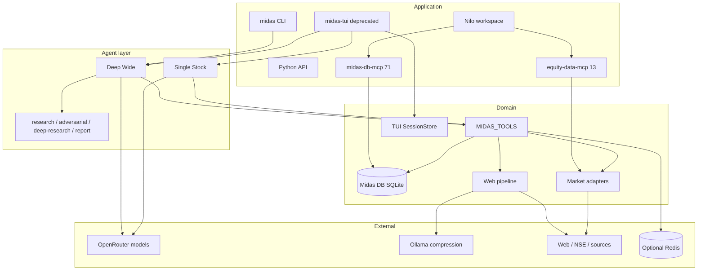

<div align="center">

# Midas

**Long-horizon Indian equity research with a durable, auditable paper trail**

Midas is a Python 3.12 research runtime for **one-to-two-year, owner-style** Indian public-equity analysis. It turns a sector, NSE index, company, or research question into staged multi-agent diligence—primary screening, adversarial challenge, equal-depth deep research, and an investment-committee decision—persisted in **Midas DB** (SQLite), not a stack of Markdown/PDF files.

The primary client is **Nilo** (Codex / Grok / OpenCode / Deep Agents) via `.nilo/` branding, a **16-skill** routing pack, and **two** stdio MCP servers. The in-process path keeps **two** research modes, **four** DeepAgents subagent roles, **73** LangChain tools, **13** domain tables with **29** indexes across **4** migrations, and a grounded web pipeline capped at **3** concurrent page fetches per call. Market MCP responses are scrubbed of external URLs on the wire. The repository documents those resource bounds explicitly; it does **not** include production latency, throughput, or uptime telemetry.

[](https://www.python.org/)
[](./pyproject.toml)
[-purple)](https://github.com/aneeshpatne/Midas)
[](https://github.com/langchain-ai/deepagents)
[](https://modelcontextprotocol.io/)
[](https://docs.astral.sh/uv/)
[](./LICENSE)

</div>

---

## Overview

Midas is research software for **one-to-two-year, owner-style** Indian public-equity analysis. It separates business quality, valuation, evidence confidence, governance, and liquidity; allows **zero to three** final selections; and labels incomplete work as *Insufficient Evidence* instead of inventing answers.

| Surface | Role |
| --- | --- |
| **Nilo workspace** | Primary client: open this repo in the Nilo Electron app (Codex / Grok / OpenCode / Deep Agents). Branding and starter prompts live in `.nilo/`; skills + `AGENTS.md` route equity research and paper-portfolio work. |
| **Deep Wide / Single Stock** | In-process DeepAgents graphs for universe screening and one-name dossiers (also used by CLI). |
| **Skills pack** | Mercury-style Codex skills under `skills/` (single-stock, named-comparison, broad-universe, auditors, paper portfolio). |
| **CLI** (`midas`) | One-shot research from the terminal. |
| **Library** | Web research, fundamentals, and market-signal helpers as Pydantic models. |
| **MCP** | Two stdio servers (`equity-data-mcp`, `midas-db-mcp`) for Nilo providers and other hosts: market info and Midas DB (including approval-gated trade proposals). |
| **Textual TUI** (`midas-tui`) | Legacy interactive sessions — being sunset; prefer Nilo. |

**Durable output lives in Midas DB** (SQLite): research runs, append-only evidence, securities master, and optional paper portfolios. Agents write stage results as evidence rows and store the final A–J decision text on the run (`report_md`). Intermediate Markdown files and PDF/HTML final reports are **not** required deliverables. Each evidence row receives a monotonically increasing sequence number within its research run, making stage history queryable without relying on filesystem ordering.

> [!NOTE]
> Conclusions are research assessments for a stated analysis cut-off. They are **not** brokerage execution, personalized investment advice, or guaranteed market data. Paper-portfolio tools are ledger demos, not live trading.

## Engineering highlights

The metrics below are verified from the implementation and a local validation run on **2026-08-27**. They describe supported surface area, safety bounds, and test outcomes—not production throughput, uptime, or p95 latency.

| Area | Verified engineering fact |
| --- | --- |
| **Agent workflow** | Deep Wide uses **10** ordered evidence `record_type`s from mandate through IC decision; Single Stock uses a focused **4-record** path (`mandate`, `company_dossier`, `valuation_and_risk`, `focused_conclusion`). **Four** named subagents (`research-agent`, `adversarial-agent`, `deep-research-agent`, `report-agent`) sit under the Deep Wide lead. Final `report_md` follows a fixed **A–J** (10-section) decision structure. |
| **Tool surface** | `MIDAS_TOOLS` registers **73** in-process tools: **13** market-information, **49** Midas DB (including **7** `trade_proposal_*` tools), **8** chart generators, plus `web_research`, `twitter_search`, and `send_update`. |
| **MCP surface** | Two stdio servers: `equity-data` exposes **13** market tools (URLs scrubbed on the wire; host timeout guidance **180 s**); `midas-db` exposes **71** DB operations (host timeout guidance **60 s**). |
| **Data model** | Bootstrap schema: **13** domain tables (+ `schema_migrations`), **29** indexes, **4** versioned migrations. SQLite `STRICT` tables, foreign keys, WAL journaling, and a **5,000 ms** busy timeout. Paper ledger supports **12** transaction types and **5** trade-proposal statuses (`DRAFT` → `EXECUTED`). Research runs use **3** workflows and **5** run statuses. |
| **Index coverage** | `nse_list_index` / market-scan tools accept **122** named NSE index / special-list values from the `NseIndex` enum (broad market, sectoral, and F&O universes). |
| **Grounded web pipeline** | Each `web_research` call accepts **1–10** result targets and fetches at most **3** pages concurrently; cleaned source text is capped at **12,000** characters and compressed output at **4,800**. Browser startup gets **2** attempts, then HTTP fallback with a **20 s** timeout, **5** redirects, and a **4 MiB** body limit. Search itself uses a **15 s** timeout. |
| **Caching and contention** | Success-only JSON tool responses are cached with TTLs of **5 min** (live), **1 h** (market), **6 h** (web), **24 h** (company/signals), or **7 d** (transcripts). Redis connect/read timeouts are **0.25 s / 0.5 s**; failure is fail-open to a process-local **256-entry** LRU. Per-source single-flight gates plus a market-MCP sequential gate return non-blocking `busy` / `retryable` JSON. X search is capped at **2** calls per agent (**60 s** CLI timeout). |
| **Nilo / skills pack** | **16** skill directories under `skills/`, root `AGENTS.md` router, **8** Nilo starter prompts, and **2** declared Deep Agents in `.nilo/agents.json`. Console scripts: **6** entry points (including deprecated `midas-tui` / `midas-mcp` aliases). |
| **Codebase shape** | **60** Python modules under `src/midas/`, **25** `tests/test_*.py` modules, **9** agent Markdown instruction files under `agents/`. |
| **Validation snapshot** | Default `pytest` collected **183** tests: **169 passed**, **12 skipped** (opt-in `MIDAS_RUN_INTEGRATION=1` network/browser/PDF checks), **2 failed** in [`tests/test_reporting.py`](./tests/test_reporting.py). `ruff check .` reported **7** lint errors (**6** auto-fixable). No load-test suite or production telemetry is checked into the repository. |

---

## Features

| Area | What you get |
| --- | --- |
| **Two research modes** | Deep Wide (universe funnel, 10 evidence stages) and Single Stock (one name, 4 evidence stages). |
| **Decision standard** | Reproducible quality scoring, ordered gates, valuation zones, scenario returns, **zero-to-three** final selections; incomplete work labeled *Insufficient Evidence*. |
| **Midas DB** | **13** domain tables for research runs, evidence ledger, companies/securities, paper portfolios, **approval-gated** trade proposals, cash/trade ledger (**12** tx types), thesis revisions. |
| **Indian market tools** | **13** market-info tools: fundamentals, signals, filings, quotes, trading history, **122** index lists, scans, calendars, deals, derivatives, institutional flows, market context. |
| **Grounded web research** | Search → Camoufox/HTTP fetch → main-text extract → Ollama compression; **≤3** concurrent fetches; **12k / 4.8k** char caps. |
| **Dual MCP servers** | `equity-data-mcp` (**13** tools, URL-scrubbed) and `midas-db-mcp` (**71** operations). |
| **DeepAgents integration** | Same market + DB + chart tools on LangChain agents (`MIDAS_TOOLS` = **73**). |
| **Skills / Nilo** | **16** Codex-oriented skills + **8** Nilo starter prompts; TUI is deprecated. |
| **Resilience** | Per-source single-flight gates, sequential market-tool policy, optional fail-open Redis cache (TTL **5 min–7 d**), X search budget **2**/agent. |
| **Optional charts** | **8** PNG chart tools (bar, horizontal-bar, line, area, pie, stacked-bar, scatter, heatmap)—chat aids, not the system of record. |

---

## From prompt to decision (Deep Wide)

```mermaid
flowchart LR
  A[User prompt] --> B[Lead analyst]
  B --> C[research_run_create + mandate]
  C --> D[universe evidence]
  D --> E[Research agent]
  E --> F[primary_screen + shortlist]
  F --> G[Adversarial agent]
  G --> H[blind + red team]
  H --> I[deep_dive_shortlist]
  I --> J[Deep-research agent]
  J --> K[equal_depth]
  K --> L[finalist_bear]
  L --> M[ic_decision]
  M --> N[Report agent]
  N --> O[report_md + COMPLETED in DB]
```



Stages run **sequentially** because market scrape tools are single-flight per source (fundamentals, signals, NSE, web, X). Only `web_research` is exempt from the cross-market sequencing rule. Successful expensive tool responses can be cached in Redis; errors are never cached. The Deep Wide graph includes four named subagent roles—`research-agent`, `adversarial-agent`, `deep-research-agent`, and `report-agent`—around the lead agent.

### Evidence ledger (system of record)

Each request creates **one** research run. Stage work is append-only:

| `record_type` | Owner |
| --- | --- |
| `mandate` | Lead |
| `universe` | Lead |
| `primary_screen` / `primary_shortlist` | Research agent |
| `adversary_independent` / `adversary_critique` | Adversarial agent |
| `deep_dive_shortlist` | Lead |
| `equal_depth` | Deep-research agent |
| `finalist_bear` | Adversarial agent |
| `ic_decision` | Lead |
| sources / calculations | Any stage (`source`, `calculation`, …) |

Final A–J decision text is stored via `research_run_set_report` and finalized with `research_run_complete`. Chat returns the **`research_run_id`** and a short synthesis—not a PDF path.

**A–J report structure** (in `report_md`): Executive Decision Summary · Candidate Funnel · Complete Comparative Matrix · Primary-Source Evidence Map · Governance and Capital-Allocation Matrix · Expected-Return Models · False-Negative Challenge · Final Candidates · Rejected Finalists · Final Conclusion.

---

## Architecture



**Design notes:**

- **Agent construction** — `create_research_agent(mode)` for mode-aware dispatch; `create_midas_agent()` / `create_single_stock_agent()` for explicit graphs. Both share `MIDAS_TOOLS` (**73** tools: market + DB + charts + web + X + progress).
- **Models** — lead/research/adversarial: OpenRouter `openai/gpt-5.6-luna` (medium reasoning); deep-research and report synthesis: same model, high reasoning. Compression uses a local Ollama OpenAI-compatible endpoint (`gpt-oss:120b-cloud` default in `pipeline.py`).
- **Tool contracts** — compact JSON with `ok`; market tools may return `status: "busy"` / `retryable: true` under single-flight or sequential gates. DB tools share the same response shape. Market MCP additionally drops URL-bearing fields before they leave the process.
- **Web-pipeline bounds** — each `web_research` call targets **1–10** results and scrapes up to **3** pages concurrently (**15 s** search timeout). Browser startup is retried **twice**; if it still fails, the HTTP path enforces a **20 s** timeout, **5** redirects, and a **4 MiB** response cap.
- **Cache policy** — success-only tool responses use TTLs of **5 minutes** (live), **1 hour** (market), **6 hours** (web), **24 hours** (company/signals), or **7 days** (transcripts). Redis connect/read timeouts are **0.25 s / 0.5 s**; failure degrades to a **256-entry** in-process LRU. X search is limited to **2** calls per agent.
- **Persistence** — research and paper portfolios in `midas.db` (override with `MIDAS_DB_PATH`); deprecated TUI sessions in `output/.midas-sessions.sqlite3`; optional session workspaces under `output/<session-id>/` for charts/scratch only (gitignored).

---

## Midas DB

SQLite **STRICT** tables, WAL mode, foreign keys, and a **5,000 ms** busy timeout. The bootstrap schema contains **13** domain tables and **29** indexes; schema evolution is represented by **4** migrations (versions 1–4), including approval-gated `trade_proposals`. Schema source of truth: `src/midas/db/migrate.py` and `src/midas/db/schema.bootstrap.sql`.

| Domain | Tables (high level) |
| --- | --- |
| Master data | `companies`, `securities`, `market_prices` |
| Paper portfolio | `portfolios`, `portfolio_accounts`, `investment_cases`, `thesis_revisions`, `trade_proposals`, `transactions` |
| Research | `research_runs`, `research_run_securities`, `research_evidence`, `research_portfolio_links` |

The research ledger is append-oriented: `research_evidence` stores stage, source, and calculation payloads with per-run sequence numbers and indexes for run order, record type, and symbol. Portfolio amounts use integer **paise** (₹1 = 100 paise) and quantities use integer **micros** (1 share = 1_000_000 micros) to avoid floating-point ledger arithmetic. BUY/SELL must go through `trade_proposal_create` → explicit user approval of that proposal ID → `trade_proposal_approve` → `trade_proposal_execute` (**5** proposal statuses).

```bash
# Apply migrations (creates midas.db in the project root by default)
uv run midas-db-migrate

# Or bootstrap from SQL
sqlite3 midas.db < src/midas/db/schema.bootstrap.sql
```

Environment:

```dotenv
MIDAS_DB_PATH=/absolute/path/to/midas.db   # optional
```

Python:

```python
from midas.db import run_migrations, portfolios_service, research_runs_service
from midas.db.models import CreatePortfolioInput, CreateResearchRunInput

run_migrations()
pf = portfolios_service.create(CreatePortfolioInput(name="Demo book"))
run = research_runs_service.create(
    CreateResearchRunInput(
        slug="demo-co-7y",
        workflow="single_stock",
        universe_or_company="Demo Company",
        horizon_text="7 years",
    )
)
```

---

## Tech stack

| Layer | Technology |
| --- | --- |
| Language | Python **3.12+** (`requires-python >=3.12`) |
| Packaging | [uv](https://docs.astral.sh/uv/), project `midas` **0.1.0**, **6** console scripts |
| Primary UI | Nilo Electron workspace (`.nilo/` branding + skills); Textual TUI **deprecated** |
| Agents | [DeepAgents](https://github.com/langchain-ai/deepagents) / LangGraph / LangChain tools (**73** `MIDAS_TOOLS`) |
| MCP | [MCP](https://modelcontextprotocol.io/) Python SDK (FastMCP): **13** + **71** tools |
| Models | [OpenRouter](https://openrouter.ai/) (`openai/gpt-5.6-luna`); Ollama for compression |
| Search / fetch | ddgs, Camoufox, httpx, BeautifulSoup/lxml, trafilatura (**≤3** concurrent pages) |
| Market data | `nse`, `nselib`, `indian-market-data`, HTTP helpers (**122** `NseIndex` values) |
| Persistence | SQLite Midas DB (**13** domain tables, WAL, FK, **5 s** busy timeout); optional Redis tool cache |
| Charts | Pillow — **8** PNG chart tools |
| Quality | pytest, pytest-asyncio, ruff (**183** collected tests in the latest local run) |

---

## Project structure

```text
midas/
├── pyproject.toml                   # midas 0.1.0; 6 console scripts
├── AGENTS.md                        # Nilo/Codex skill router
├── skills/                          # 16 equity-research + paper-portfolio skills
├── .nilo/                           # branding.json, agents.json, logo
├── agents/                          # 9 Markdown role files (DeepAgents / CLI)
│   ├── shared/                      # Policy + tool/MCP guidance
│   ├── deep-wide/                   # Lead + 4 stage roles
│   └── single-stock/
├── examples/
├── src/midas/                       # 60 Python modules
│   ├── cli.py                       # midas
│   ├── mcp_server.py                # equity-data-mcp (13 tools; URL scrub)
│   ├── db_mcp_server.py             # midas-db-mcp (71 ops)
│   ├── mcp_sanitize.py              # MCP wire URL/vendor scrubber
│   ├── pipeline.py                  # Web search → scrape → compress
│   ├── market_data.py
│   ├── sessions.py                  # Deprecated TUI SQLite sessions
│   ├── db/                          # Midas DB (13 domain tables, 4 migrations)
│   │   ├── schema.bootstrap.sql
│   │   ├── migrate.py               # midas-db-migrate
│   │   ├── connection.py
│   │   ├── models.py
│   │   ├── repositories/
│   │   └── services/
│   ├── tui/
│   └── deepagents/
│       ├── deepagent.py             # Agent factories + tool guidance
│       ├── tools.py                 # Market + web + charts
│       ├── db_tools.py              # In-process DB tools (same as midas-db-mcp)
│       ├── prompts.py               # DB-driven workflow contracts
│       ├── charts.py
│       ├── model.py
│       └── cache.py
├── tests/
└── output/                          # Sessions, optional charts (gitignored bulk)
```

---

## Requirements

- **Python** 3.12+ and [uv](https://docs.astral.sh/uv/)
- **Camoufox** browser binary (`uv run python -m camoufox fetch`)
- **Ollama** for compression (`gpt-oss:120b-cloud` by default)
- **Credentials**
  - `OPENROUTER_API_KEY` — required for research agents
  - `OPENAI_API_KEY` — expected by the TUI setup check; also used as a non-empty key for the Ollama OpenAI-compatible client
- **Network** for search and market tools
- **Optional:** Redis (`MIDAS_REDIS_URL` / `REDIS_URL`); local `grok` CLI for `twitter_search` (capped per agent)

---

## Getting started

### 1. Install

```bash
git clone <repository-url>
cd Midas
uv sync
uv run python -m camoufox fetch
```

### 2. Environment

```bash
cp .env.example .env
```

```dotenv
OPENROUTER_API_KEY=...
OPENAI_API_KEY=...
OLLAMA_BASE_URL=http://localhost:11434/v1
# MIDAS_DB_PATH=./midas.db
# MIDAS_REDIS_URL=redis://localhost:6379/0
```

```bash
ollama pull gpt-oss:120b-cloud
uv run midas-db-migrate
```

### 3. Run research

```bash
# One-shot CLI
uv run midas "Summarize TCS's latest results and concall guidance"
uv run midas "NIFTY IT quality screen, 2-year horizon"

# Interactive TUI (deprecated — prefer Nilo)
uv run midas-tui
```

### 4. Library

```python
from midas import web_search

result = web_search("Recent developments in sodium-ion batteries", max_results=5)
print(result.compressed)
```

```python
from midas.deepagents.deepagent import create_research_agent
from midas.deepagents.modes import ResearchMode

agent = create_research_agent(ResearchMode.SINGLE_STOCK)
# await agent.ainvoke({"messages": [("user", "...")]})
```

> [!IMPORTANT]
> Do not commit API keys. Respect third-party terms, robots rules, and rate limits when fetching external data.

---

## MCP servers

### Market info — `equity-data-mcp`

Exposes **13** market-information tools covering fundamentals, signals, and exchange market structure (including **122** named index/list values for constituent listing). **Not** included: web search, X/Twitter, charts, or agent UI helpers. The MCP server id is generic (`equity-data`); the deprecated CLI alias `midas-mcp` still points here.

**MCP wire policy:** tool descriptions and JSON responses are scrubbed of external URLs, vendor hostnames, and example company tickers before they leave the process.

```bash
uv run equity-data-mcp
```

| Behavior | Detail |
| --- | --- |
| Tool count | **13** market tools |
| Concurrency | One active call per source; process-wide sequential gate across market tools |
| Busy response | JSON `ok: false`, `status: "busy"`, `retryable: true` |
| Host timeout guidance | **180 s** (Codex / OpenCode project configs) |
| URLs on wire | Never — `source_url` / `https://…` fields are dropped or redacted |

### Midas DB — `midas-db-mcp`

Paper portfolios, securities master, investment cases, thesis revisions, approval-gated trade proposals, transactions, research runs, and evidence ledger. The server registers **71** DB operations; DeepAgents expose a **49**-tool in-process DB surface (`MIDAS_DB_TOOLS`). BUY/SELL must go through `trade_proposal_*` after explicit user approval of a proposal ID. Same persistence and validation rules apply to both paths.

```bash
uv run midas-db-mcp
```

| Behavior | Detail |
| --- | --- |
| Tool count | **71** MCP operations / **49** in-process DB tools |
| Schema | Migrations **1–4** applied on server start |
| Money | Integer **paise** (₹1 = 100 paise) |
| Quantity | Integer **micros** (1 share = 1_000_000 micros) |
| Time | Epoch milliseconds |
| Host timeout guidance | **60 s** (Codex / OpenCode project configs) |

### Codex config example

Run Codex with this repository as the working directory (no machine-specific absolute paths):

```toml
[mcp_servers.equity-data]
command = "uv"
args = ["run", "equity-data-mcp"]
tool_timeout_sec = 180

[mcp_servers.midas-db]
command = "uv"
args = ["run", "midas-db-mcp"]
tool_timeout_sec = 60
```

### Cursor / Claude Desktop-style hosts

```json
{
  "mcpServers": {
    "equity-data": {
      "command": "uv",
      "args": ["run", "equity-data-mcp"]
    },
    "midas-db": {
      "command": "uv",
      "args": ["run", "midas-db-mcp"]
    }
  }
}
```

Harness-agnostic agent instructions (roles, evidence types, tool names) live under [`agents/`](./agents/) and `skills/`. Do not commit research run output, `midas.db`, or machine-local MCP path overrides.

---

## TUI controls (deprecated)

> [!WARNING]
> `midas-tui` is **deprecated** and will be removed. Use the Nilo Electron client with this repo as the workspace instead.

| Input | Action |
| --- | --- |
| `/` | Slash-command dropdown |
| `Enter` | Submit prompt (or complete command) |
| `Ctrl+C` | Cancel active research, or quit when idle |
| `Ctrl+N` / `/new` | New session in the current mode |
| `Shift+Tab` | Switch research mode (new session) |
| `/sessions` | List resumable sessions |
| `/resume [id]` | Resume a session |
| `F2` / `F3` | Toggle agents/todos and files panes |
| `/exit` | Save and exit |

Sessions: `output/.midas-sessions.sqlite3`. Mode switches start a **new** session so deep-wide and single-stock context are not mixed.

---

## Testing

```bash
uv run ruff check .
uv run pytest

# Live network + Camoufox (opt-in)
MIDAS_RUN_INTEGRATION=1 uv run pytest -m integration
```

The suite contains **25** `tests/test_*.py` modules. On **2026-08-27**, default `pytest` collected **183** tests and finished in about **9 s** locally: **169 passed**, **12 skipped** (gated behind `MIDAS_RUN_INTEGRATION=1` for live network/browser/PDF checks), and **2 failed** in [`tests/test_reporting.py`](./tests/test_reporting.py) (reporting-artifact expectation drift). Coverage includes cleaning/pipeline models, market adapters, DeepAgent tools and DB-driven workflow contracts, Midas DB services (including trade proposals), MCP registration and URL scrubbing, CLI/TUI wiring, and sessions. No coverage percentage is published. The same environment reported **7** `ruff` lint errors (**6** auto-fixable). There is no checked-in load-test or latency benchmark harness.

---

## CLI entry points

| Command | Purpose |
| --- | --- |
| `midas` | One-shot research CLI |
| `midas-tui` | Deprecated Textual app (prefer Nilo) |
| `equity-data-mcp` | Generic market-info MCP (stdio; URLs scrubbed) |
| `midas-mcp` | Deprecated alias of `equity-data-mcp` |
| `midas-db-mcp` | Midas DB MCP (stdio) |
| `midas-db-migrate` | Apply SQLite migrations |

---

## Roadmap

- Align TUI credential checks with tools that actually need each key (e.g. vision helper vs. research path).
- Expand `.env.example` for OpenRouter, Redis, `MIDAS_DB_PATH`, and chart paths.
- Further ergonomics for large equal-depth batches without thinning the fixed diligence packet.
- Optional read-only UI over research runs and paper portfolios.

---

## Disclaimer

**Not investment advice.** Midas is research software for educational and informational use. Outputs are automated research assessments for a stated analysis cut-off. They are **not** personalized investment recommendations, solicitations to buy or sell securities, portfolio management, brokerage services, or financial, legal, or tax advice. You are solely responsible for any investment decisions and for complying with laws that apply to you.

**No warranties; use at your own risk.** The software and any data it retrieves are provided “as is,” without warranty of accuracy, completeness, timeliness, or fitness for a particular purpose. Market data can be delayed, incomplete, misparsed, or wrong. Do not rely on tool output as a sole basis for trading or compliance decisions.

**Paper portfolios are not brokerage.** Deposits and proposal-executed buys/sells in Midas DB are demo ledger events only. They do not place orders or move real capital.

**Third-party data and terms.** Midas may fetch information from public web pages, exchanges, and other third-party services. Those sources are not affiliated with this project. Comply with each provider’s terms, robots rules, rate limits, and applicable law. This repository does **not** grant any license to third-party content or trademarks.

**Liability.** To the maximum extent permitted by law, authors and contributors are not liable for any loss or damage arising from use of this software or reliance on its outputs—including trading losses, data inaccuracies, or account restrictions imposed by third parties.

---

## License

Licensed under the [Apache License, Version 2.0](./LICENSE).

You may use, modify, and distribute this software under that license. Redistribution must preserve the copyright notice, license text, and any `NOTICE` file. The license does **not** grant trademark rights in the project name. This is a plain-language summary only; the full legal text is in [`LICENSE`](./LICENSE).

---

<div align="center">
  Built with Python, DeepAgents, Textual, SQLite, and a stubborn preference for source-backed equity research over narrative conviction.
</div>
